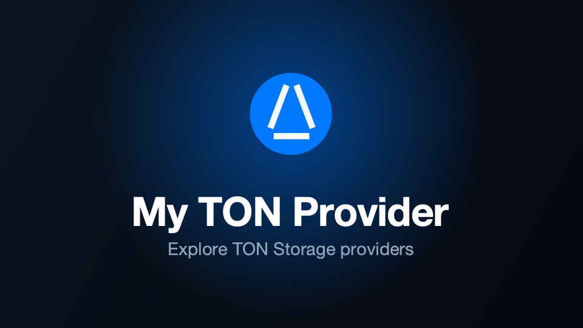

# 💎 My TON Provider

[](LICENSE)
[](https://core.telegram.org/bots/webapps)
[](https://www.python.org/)
[](https://fastapi.tiangolo.com/)
[](https://react.dev/)
[](https://www.docker.com/)



**My TON Provider** is a Telegram Mini App for monitoring TON storage providers. Browse the public catalog, or verify
ownership to track your own provider and get alerted when something goes wrong — in Telegram or the browser.

## Features

- **Catalog** — search, sort and filter the public provider list.
- **Details** — status, telemetry, hardware and network for any provider.
- **Alerts** — the bot pings you on downtime, overload, restarts and more.
- **Synced** — favorites, theme and language follow your account.
- **Owner tools** — metrics, earnings, balance and charts for your own provider.

## Usage

1. Copy the environment file and fill it in (see [Environment Variables](#environment-variables)):
   ```bash
   cp .env.example .env
   ```
2. Build and start with Docker Compose:
   ```bash
   docker compose up --build
   ```

The frontend is compiled into the backend's static directory, migrations run, and the service starts on `:8080`.

### Local development

Backend:

```bash
cd app/backend
alembic upgrade head
python -m app
```

Frontend:

```bash
cd app/frontend
pnpm install
pnpm dev
```

In dev the frontend calls the backend at `http://localhost:8080` and mocks the login; override the defaults with `VITE_*` in `app/frontend/.env` (see [Environment Variables](#environment-variables)). Outside Telegram the production app authenticates through the Telegram Login Widget.

## Environment Variables

| Variable                | Type    | Description                                              | Example                   |
|-------------------------|---------|----------------------------------------------------------|---------------------------|
| `DEBUG`                 | `bool`  | Verbose `app.*` debug logging; keep `false` in production | `false`                   |
| `API_RATE_LIMIT`        | `int`   | Requests per window per client IP on catalog endpoints (bag, provider) | `100`       |
| `API_RATE_WINDOW`       | `int`   | Rate-limit window, in seconds                            | `60`                      |
| `WEBAPP_URL`            | `str`   | Public app URL; base for the Telegram bot webhook        | `https://mtp.example.com` |
| `BOT_TOKEN`             | `str`   | Bot token from @BotFather                                | `123456:qweRTY`           |
| `BOT_USERNAME`          | `str`   | Bot username, without `@`                                | `mytonproviderbot`        |
| `BOT_WEBHOOK_SECRET`    | `str`   | Secret guarding the webhook endpoint                     | `s3cret`                  |
| `BOT_DEV_IDS`           | `int[]` | Comma-separated Telegram user IDs that receive worker error reports; empty disables | `123,456`     |
| `BOT_ADMIN_IDS`         | `int[]` | Comma-separated Telegram user IDs granted admin access    | `123,456`                 |
| `JWT_SECRET`            | `str`   | Session-token signing key (≥ 32 bytes)                   | `a-long-random-string`    |
| `TG_CLIENT_ID`          | `int`   | Telegram Login Widget client ID (OIDC)                   | `123456789`               |
| `TG_CLIENT_SECRET`      | `str`   | Telegram Login Widget client secret                      | `qweRTY`                  |
| `TONCENTER_API_KEY`     | `str`   | toncenter API key                                        | `qweRTY`                  |
| `TONCENTER_API_RPS`     | `float` | toncenter rate limit, requests per second                | `10`                      |
| `MYTONPROVIDER_API_KEY` | `str`   | mytonprovider API key                                    | `qweRTY`                  |
| `MYTONPROVIDER_API_RPS` | `float` | mytonprovider rate limit, requests per second            | `10`                      |

The frontend also reads three `VITE_*` variables, inlined by Vite at build time (not from the runtime `.env`):

- `VITE_BACKEND_BASE` — this backend's origin. Defaults to same-origin in production (one process serves both the app and the API) and `http://localhost:8080` in dev.
- `VITE_API_BASE` — public catalog API. Defaults to `https://mytonprovider.org`.
- `VITE_TG_CLIENT_ID` — Telegram Login Widget client ID; under Docker Compose it is baked from `TG_CLIENT_ID`.

The default Docker build needs none of them set — `TG_CLIENT_ID` above covers the only one that matters.

## License

This repository is distributed under the [Apache License 2.0](LICENSE).